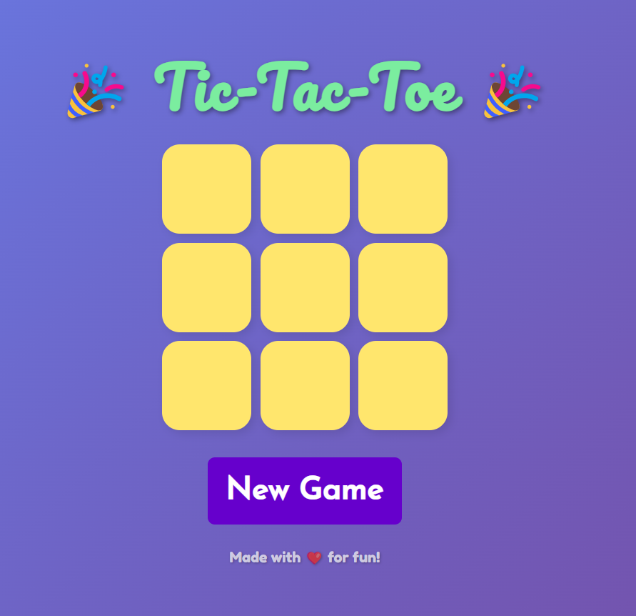
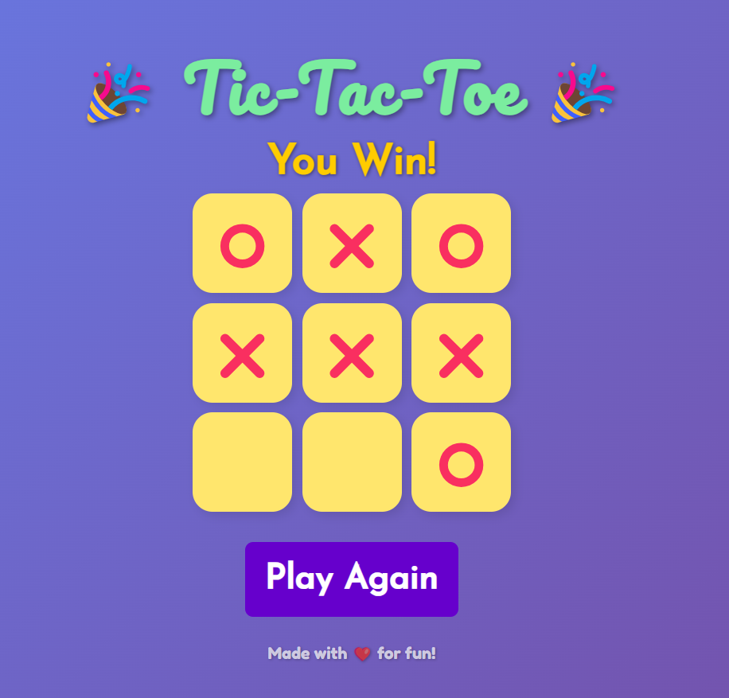

# 🎮 Tic Tac Toe – Play vs Computer

A classic Tic Tac Toe game where **you play against the computer**! Built using **HTML**, **CSS**, and **JavaScript**, this game gives you a 50-50 chance of winning. It’s simple, fast, and fun!

## 🌐 Live Demo

🔗 [Play the Game](https://yourwebsite.com)

## 📸 Screenshots

## 🧠 Features

- 🎮 **Single-player mode** against a computer
- 🤖 **Randomized AI** with 50-50 win chance
- 🔄 **Restart option** to play again instantly
- 💻 **Clean and responsive design**

## 🛠️ Tech Stack

- **HTML** – Markup for layout and elements
- **CSS** – Styling and visual enhancements
- **JavaScript** – Game logic, AI behavior, and interactivity
